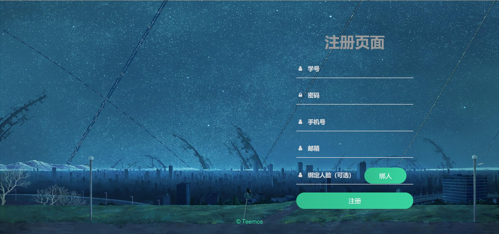

# High-end-login-module
It is my original big homework.

所需环境：
-	Apache 2.4.6
-	Mysql 8.0
-	Python 3.8
-	Flask 2.0.0

该项目以星空为主题，设计了高端登录模块，实现了完整的登录功能。

登录模块分为：
-	登录界面
- 注册界面
- 找回密码界面

同时，登录界面内有如下的登录功能：
- 账号密码登录
- 邮箱验证码登录
- 人脸识别登录

本项目采用前后端分离的方式进行部署，前端部署在apache中，后端运行在python环境下的flask里。

前端：bootstrap框架，swpier滑动插件，Ajax

后端：Flask框架，pymysql库，aip库

- fore-end-code文件夹为前端代码

- back-end-code文件夹为后端代码

# 效果图

